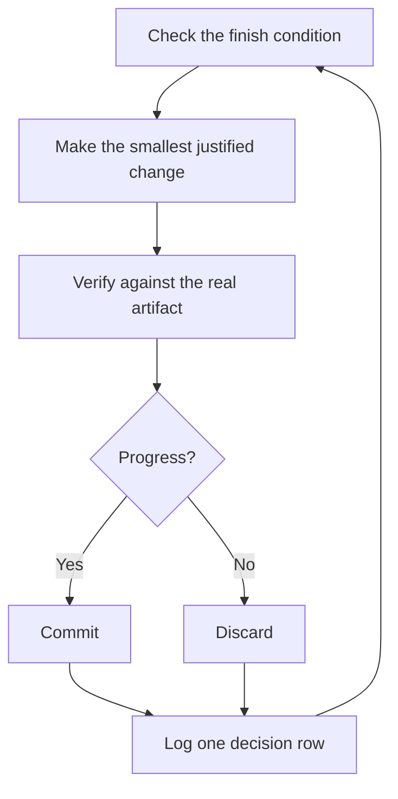

# Run work while you sleep

This is the payoff for everything before it. An agent you can trust to verify its own work is an agent you can leave alone with a hard task. What makes that safe isn't hope. It's a checkable finish condition, an isolated worktree or delegated task, and a decision log you audit in the morning.

## Earn the trust before the loop

A loop you don't trust just produces unchecked work faster, and the mess compounds with every iteration. Before you leave one running, check that it has earned it:

- You've done the task once by hand, or watched an agent do it, so you know what good looks like.
- The agent has the tools and signals you'd use yourself: the verification skill, the profiler, the logs.
- Every stage proves its work and can stop the line when the work misses the bar.
- You've read a few threads and turned the repeated failures into tools, skills, or checks.

Make the loop autonomous only after all four hold. Until then, run it while you watch.

## The overnight contract

A good handoff has the goal, the finish condition, permissions, and an escape hatch. It doesn't need to be long:

```text
/p3-mode im going to bed. migrate every caller to the new parser in a fresh worktree off <base>.
done means zero old callers, all parser fixtures pass, old api deleted.
keep a decision log. don't ask me before committing.
run until done. if you're truly stuck after a few hours, stop and write up why.
```

Walk through what each line buys you:

- "im going to bed" is a session override. The agent stops asking and keeps going.
- "done means..." turns the goal into checks every iteration can run.
- "fresh worktree off `<base>`" keeps the run from colliding with anything else you have open. A run that needs its own checkout gets a `t3_thread_launch` thread with a worktree `workspaceStrategy`.
- "don't ask me before committing" pre-answers the permission the agent would otherwise block on.
- "run until done" hands the agent the wake mechanism. The [Autonomous run playbook](../../skills/p3-mode/playbooks/autonomous-run.md) re-checks the finish condition on events or a heartbeat: `watch_pull_request` when there's a PR to watch, which wakes the thread when checks finish, a comment lands, or the branch conflicts, and a `schedule_task` interval tick when there isn't.
- The escape hatch lets it stop at a genuine dead end and write up why, which beats eight hours of creative goal reinterpretation.

Because you'll review this work after stepping away, `/p3-mode` routes it through [`/figure-it-out`](../../skills/figure-it-out/SKILL.md), which designs the run's phases before any code and wires in the decision log.

To stop a run on purpose, tell the agent to pause, or that you're about to go offline or restart T3 Code. The [Pause safely playbook](../../skills/p3-mode/playbooks/pause-safely.md) finishes or backs out of the current step, cancels delegated tasks with `task_cancel`, commits a work-in-progress checkpoint, and writes a resume note. The thread is durable, so the same thread or a fresh one picks the work up from that note through the [Session pickup playbook](../../skills/p3-mode/playbooks/session-pickup.md). Saying "keep going" never triggers a pause.

## What the loop does all night



One change, one check, one log row, every iteration. Changes that didn't help get discarded, not left to ride. A plateau means pivot, not stop, and the finish condition never quietly relaxes to declare victory.

## The morning audit

[`/show-me-your-work`](../../skills/show-me-your-work/SKILL.md) is what makes the run reviewable. Each row records the time, phase, decision, reason, an evidence pointer, and the result, in a TSV at `decisions.tsv` (or `.audit/<task-slug>.tsv` when several runs share a directory). It stays local by default. Commit it when the work is ambitious enough that a reviewer needs the trail to trust the result.

When you're back, ask for the run in review form:

```text
/show-me-your-work catch me up on what you did last night
```

Before the skill hands back its summary, it audits the log against the thread with `t3_thread_read`, then delegates a read-only reviewer on a different model family to read the trail and the thread. The reply ends with an Attention section listing what deserves your scrutiny. Read that section first, then the log rows it points at. You're auditing decisions, not re-reading the whole night.

## When the night holds a queue, not a task

The contract above drives one task to one finish condition. Some nights hold more, a queue of independent changes or a whole program. Three playbooks scale the same trust up. Each one arms an hourly audit tick with `schedule_task` on your go, so the run doesn't depend on the agent remembering to check.

[Autopilot-full](../../skills/p3-mode/playbooks/autopilot-full.md) runs a queue of independent PRs to merged. Each PR gets one owner, a `delegate_task` child that carries it from build through merge, and no owner merges on its own verdict. A swarm of fresh verifiers starts a round at the owner's code-ready head and again at every later push that changes the patch. Only a clean verdict on the patch that merges authorizes the merge:

```text
/p3-mode full autopilot on this queue. each item is independent. i want them merged by morning.
```

[Autopilot-stack](../../skills/p3-mode/playbooks/autopilot-stack.md) runs the same owner loop but ships nothing. You wake up to one linear base-branch stack with a verifier's verdict on every link, and you review and land it yourself. Every layer is registered with `link_pull_request` as it joins, so `list_thread_pull_requests` shows the stack bottom to top. Pick it over Autopilot-full when the changes are coupled, or when you want your own eyes on the work before anything merges:

```text
/p3-mode autopilot these five changes but stack them, don't ship. i'll land the stack in the morning.
```

[Orchestrate](../../skills/p3-mode/playbooks/orchestrate.md) is for a program that outlives any single agent: multi-day, many stacked PRs, fleets of delegated workers under one standing coordinator thread. The coordinator authors briefs, drains what its workers finish, keeps the lowest unmerged PR green, and never writes code itself. Its bookkeeping is plain files it keeps by hand under `orchestrate/<project-slug>/`: standing orders, a unit table, the merge frontier, a verification ledger, and a status page regenerated from those tables. It's deliberately heavy machinery. If one agent could finish the work in a session, the playbook itself routes you back to the overnight contract above:

```text
/p3-mode orchestrate the store migration. own it until every package is converted and merged. i'll check in twice a day.
```

For a coupled program you want to read before anything runs, ask for a plan first. The [Multi-phase plan playbook](../../skills/p3-mode/playbooks/multi-phase-plan.md) writes a checklist with one section per PR, names the execution playbook, and stops for your go. Lint it before you approve:

```text
node skills/p3-mode/scripts/check-plan.mjs docs/<program>-plan.md
```

## Run many programs in parallel

Give each body of work its own standing coordinator thread, such as a feature, a migration, a perf push, or a tech-debt cleanup. Launch it with `t3_thread_launch` and a worktree `workspaceStrategy` so it owns its checkout. Several can run side by side. The coordinator doesn't write code. It directs workers: `delegate_task` children for most units, and its own `t3_thread_launch` threads for a worker that needs its own worktree or branch. That's the shape the Orchestrate playbook expects. Start your prompts to the coordinator with `/p3-mode`, and the workers it spawns follow the playbooks. Every brief stands alone, because a T3 child gets only its brief, never the coordinator's context.

A few habits help:

- Point the coordinator at related threads, finished ones included. It reads them with `t3_thread_read` and `t3_thread_search` instead of asking you to restate them.
- Give each PR a verification swarm before it merges, and let Autopilot-stack or Autopilot-full carry the queue.
- Ask the coordinator for a plan backed by data, and have it answer open questions with prototypes before it asks you.

One prompt can carry a whole program, from research through execution:

```text
/p3-mode refactor this repo so its architecture is more agent friendly. use /correct and /architect on past commits and review comments to find the mistakes agents make most here. use /recall for context from past threads. answer open questions with prototypes instead of asking me. come back with a plan backed by real data. once i approve it, run it with autopilot-stack or autopilot-full, and ask me which.
```

## Let loops start themselves

Every loop above still waits for you to start it. A scheduled or event-driven task removes that step. `schedule_task` runs a prompt on an interval, at a fixed time on chosen weekdays, or on each request to a webhook URL. Software maintenance splits into stages that suit this well: triage a report, reproduce it, fix it, verify the fix. Two rules keep such a line trustworthy:

- Every stage can stop the line. Triage can decide the report is expected behavior, repro can fail to reproduce it, and the fixer can judge the change too risky. Each of those outcomes is useful, because it keeps bad work from reaching the next stage, where it costs more to undo.
- Every stage hands over evidence. Repro attaches screenshots and video of the broken state, captured with `preview_*` or `device_*`, and the fix attaches before-and-after proof. A human can then check that the agent fixed the right thing before reading a line of code.

**Pitfall:** a duration is not a finish condition. "work on this for 4 hours" gives the agent nothing to check, and you'll wake up to four hours of motion instead of a result. Give the run a predicate that can pass or fail.

Next: [Steer with principle names](./08-principles.md).
